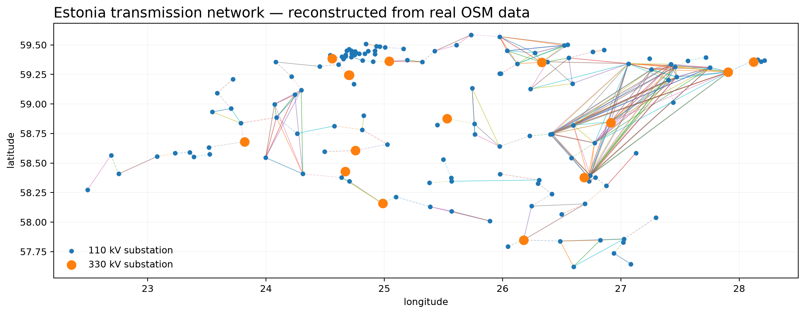
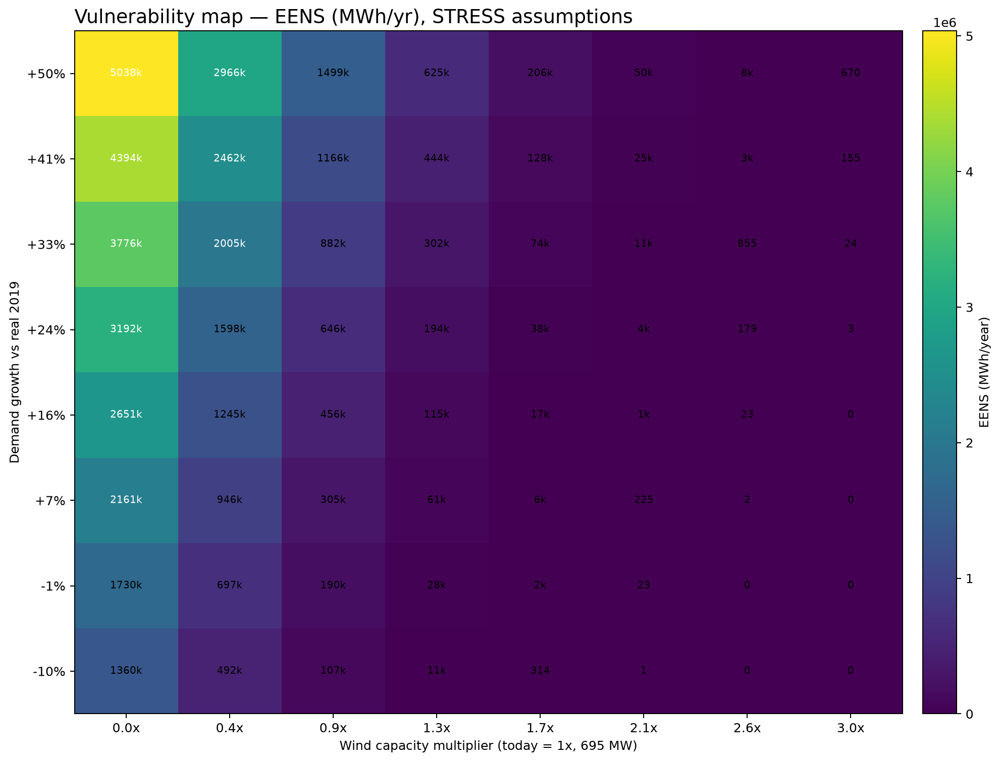
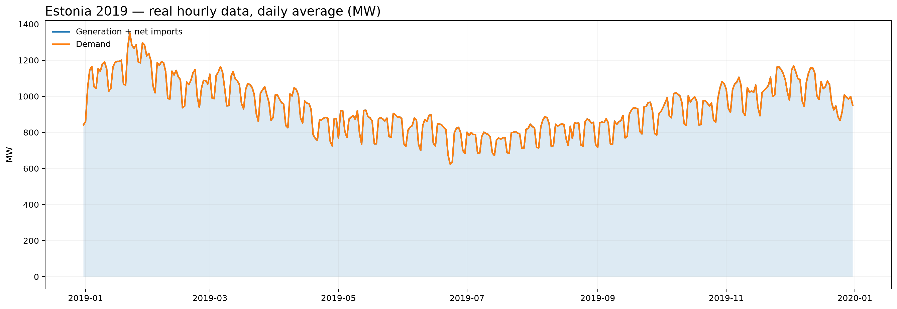

<p align="center">
  
</p>

<p align="center">
  <em>A data-driven computational framework that reconstructs, simulates and stress-tests<br>
  Estonia's electricity system using real public data.</em>
</p>

<p align="center">
  
  
  
  
</p>

---

```bash
python test_check.py
# TOTAL : 42
# PASSED: 42
# FAILED: 0
```

## What this is

Most "energy data" projects plot a CSV. This one is built like system-planning
software: a country-agnostic simulation engine, decoupled from country-specific
data and configuration, validated against real historical data, with **every
number traceable to a source and every assumption explicitly labelled**.

It goes from a national energy balance all the way to network-level power flow,
N-1 contingency analysis and Monte Carlo reliability — using real Estonian data
at every layer where real data exists, and saying so plainly where it doesn't.

## Results — the headline numbers

| Finding | Value | Real or illustrative? |
|---|---|---|
| Level 1 balance identity closure | **0.003%** of demand | REAL (2019 hourly, 8,760h) |
| Demand ↔ temperature correlation | **−0.56** (colder ⇒ +14.4 MW/°C) | REAL (ERA5 weather × Elering demand) |
| Wind speed ↔ generation correlation | **0.85** | REAL |
| Cold vs mild hours demand difference | **+53.8%** | REAL |
| Reconstructed transmission network | **155 substations, 286 lines** | REAL (193 OSM-derived) + labelled synthetic (93) |
| Real Estlink 2 outage (Dec 2024), replayed | Reserve margin held at **122%** | REAL historical event, real capacity figures |
| Monte Carlo reliability, real capacity | LOLP/EENS **≈ 0** | Genuine finding — Estonia's real margin is large |
| Monte Carlo, stress-validated | **LOLP 7.97%** | Confirms the mechanism isn't silently broken |
| N-1 contingency analysis | 286 lines ranked by criticality | REAL topology, assumed line limits |
| Capacity-optimization sweep | **3,000 plans** evaluated in ~30s | Found + fixed a real CAPEX-omission bug |

<p align="center">
  
  
</p>

<p align="center">
  
</p>

## Why Estonia

Andorra was the original candidate but publishes no machine-readable,
technology-level or capacity data. Estonia is a full ENTSO-E member with an
open-data TSO (Elering) — and turned out to have something far richer than
expected once investigated: a real 8,760-hour 2019 archive, real OSM-derived
network topology, and real ERA5 weather data.

It's also a genuinely interesting system to model: a declining-but-dominant
oil shale fleet alongside fast-growing solar and wind, two HVDC links to
Finland, and a 2025 desynchronisation from the Russian grid — a real energy
transition in progress, not a static mix.

## The honesty ledger

This is the part that matters most. Every component states what's real and
what isn't:

| Component | Status | What's real | What's assumed |
|---|---|---|---|
| **Real data** | ✅ | 8,760h real Elering archive (2019), real OSM network, real ERA5 weather (2015-2025, 6 grid points) | — |
| **Historical validation** | ✅ | Balance identity closes to 0.003% using only real data | Level 1 metrics are consistency checks, not predictive validation |
| **Cross-source validation** | ⚠️ partial | Elering (8.26 TWh, 2024) checked against Eurostat (7.14 TWh, 2022) — consistent once loss/definition/year differences are accounted for | Statistics Estonia and ENTSO-E raw figures couldn't be retrieved |
| **Dynamic model** | ✅ | 8,760h timestep replay; energy-conservation invariant tested (a real bug was found and fixed here) | Available capacity held constant |
| **Generation** | ✅ | Wind capacity/output real; oil shale plant history real (Narva/Balti/Auvere) | Oil shale marginal cost & emissions factor left `None` — not guessed |
| **Demand** | ✅ | Real hourly demand; calendar + temperature models fully data-derived | National-average weather, not per-region |
| **Interconnections** | ✅ | Real Finland (EstLink 1+2) and Latvia flows; real capacity figures | Latvia's total NTC unconfirmed |
| **Storage** | ⚠️ scenario | Physically consistent SOC model with efficiency losses | Estonia has no utility-scale storage today — every run is a "what if" |
| **Failures** | ✅ | Real Estlink 2 outage replayed; N-1 + cascading mechanics fuzz-tested | Trip thresholds and outage probabilities are illustrative |
| **Reliability** | ✅ | LOLP/LOLE/EENS verified against a stress case that produces nonzero values | Outage rates are assumptions, not Estonian statistics |
| **Network** | ⚠️ dual | Honestly-fragmented real reconstruction kept separate from a "credible" connected version | 93 of 286 lines are synthetic, always tagged as such |
| **Power flow** | ✅ | DC power flow, N-1, cascading failure on real topology | Line reactance & thermal limits are textbook-generic |
| **Economics** | ✅ | Real demand/wind shapes drive the LP and the sweep | Costs are illustrative — a flat-marginal-cost artifact is documented, not hidden |

**What this is not:** an operational replica of Elering's grid, a real
reliability assessment, or an investment recommendation. See
[`docs/limitations.md`](docs/limitations.md) for the brutally honest version.

## Architecture

```
power-system-simulator/
├── A_engine/                    # Generic engine — never hard-codes a country
│   ├── models/                  balance, generation, demand, storage, network,
│   │                            schema, units, time_handling, system_status,
│   │                            curtailment, interconnection, state
│   ├── power_flow/              dc_power_flow, n_minus_1, cascading_failure
│   ├── optimization/            economic_dispatch, capacity_expansion
│   ├── reliability/             LOLP / LOLE / EENS
│   ├── simulation/              simulator, scenarios, monte_carlo
│   ├── pipeline/                read → parse → clean → normalize → quality
│   └── io/                      config_loader, data_loader, country_registry
│
├── B_data/
│   ├── raw/                     elering/ · osm/ · weather/ · entsoe/ · statistics_estonia/
│   ├── processed/               ingested, validated, ready-to-model datasets
│   ├── metadata/                data_catalogue.csv — per-parameter provenance
│   └── sources/                 one document per data source
│
├── C_configs/                   estonia.yaml · simulation.yaml · scenarios/
├── D_analysis/                  validation (MAE/RMSE/MAPE, multi-resolution)
├── E_visualization/             index.html — open directly, zero dependencies
├── docs/                        system_definition · data_strategy · data_dictionary
│                                assumptions (22 numbered) · reliability · limitations
│                                cross_validation · models/ · figures/
├── tests/                       146 tests
└── test_check.py                one command → all 42 simulations, PASS/FAIL
```

**The core design rule:** `A_engine/` contains no country name, no capacity
figure, no interconnection name. Everything country-specific lives in
`B_data/` and `C_configs/`.

## Quick start

```bash
pip install -r requirements.txt

pytest tests/ -v          # 146 unit + invariant tests
python test_check.py      # all 42 simulations end-to-end
```

### The five canonical entry points

```bash
python run_level1_balance.py                       # historical reconstruction
python run_level2_simulation.py                    # dynamic simulation
python run_grid_simulation.py                      # network + power flow
python run_monte_carlo.py                          # reliability (LOLP/LOLE/EENS)
python run_scenario.py --scenario extreme_winter   # one named scenario
```

Everything else — N-1, cascading failure, capacity optimization, vulnerability
mapping, weather correlation — has its own `run_*.py`. Each script's docstring
states what it does and which assumptions it uses.

### Interactive dashboard

Open [`E_visualization/index.html`](E_visualization/index.html) directly in any
browser. No server, no build step, no `npm install` — real 2019 hourly data is
embedded in the file. Adjust renewable penetration, storage and import capacity
and watch the reliability metrics recompute live.

## Methodology highlights

**Data quality is enforced, not assumed.** The ingestion pipeline found and
documented two real errors in Elering's own published archive: a 25-row
year-typo block, and a genuine DST fall-back ambiguity — both corrected with
full logging, never silently patched.

**Physical invariants are tested, not hoped for.** Energy conservation, capacity
limits, battery SOC bounds, congestion detection and timestamp integrity are all
verified against randomised inputs — which is how a real energy-conservation bug
in the storage dispatch was caught and fixed.

**Assumptions are numbered and auditable.** All 22 live in
[`docs/assumptions.md`](docs/assumptions.md) with value, reason, source and
confidence level. Values that couldn't be sourced (oil shale emissions factor,
Latvia's total NTC) are left `None` — never silently defaulted to zero.

## Documentation map

| Question | Where |
|---|---|
| What's the system boundary? | [`docs/system_definition.md`](docs/system_definition.md) |
| Where did the data come from? | [`docs/data_strategy.md`](docs/data_strategy.md) · `B_data/sources/` · `B_data/metadata/data_catalogue.csv` |
| What does each variable mean? | [`docs/data_dictionary.md`](docs/data_dictionary.md) |
| What's REAL vs DERIVED vs ASSUMED? | [`docs/data_taxonomy.md`](docs/data_taxonomy.md) |
| Every assumed value, numbered | [`docs/assumptions.md`](docs/assumptions.md) |
| What doesn't work / isn't real | [`docs/limitations.md`](docs/limitations.md) |
| How was cross-validation done? | [`docs/cross_validation.md`](docs/cross_validation.md) |
| Reliability methodology | [`docs/reliability.md`](docs/reliability.md) |

## Data sources

- **[Elering](https://elering.ee)** — Estonian TSO. Hourly system archive (2019), installed capacity, official Grid Code reserve requirement.
- **[OpenStreetMap](https://www.openstreetmap.org)** — transmission network topology (substations, lines, voltages, coordinates), extracted via `earth-osm`.
- **[Open-Meteo / ERA5](https://open-meteo.com)** — hourly reanalysis weather, 2015-2025, six grid points across Estonia.
- **[Eurostat](https://ec.europa.eu/eurostat)** — independent cross-check on national consumption figures.

## Author

**Joan Pallarès** — Electrical Engineer, MSc in Computational Engineering and Simulation.

## License

Code: [MIT](LICENSE). Datasets under `B_data/` remain subject to their
original terms — OpenStreetMap data is © OpenStreetMap contributors
(ODbL) and requires attribution if redistributed. See [`LICENSE`](LICENSE)
for details.
